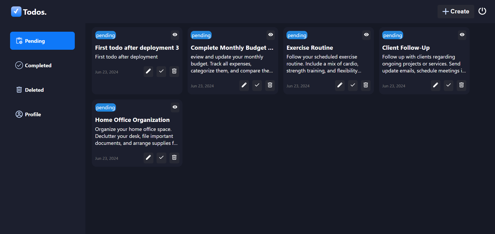
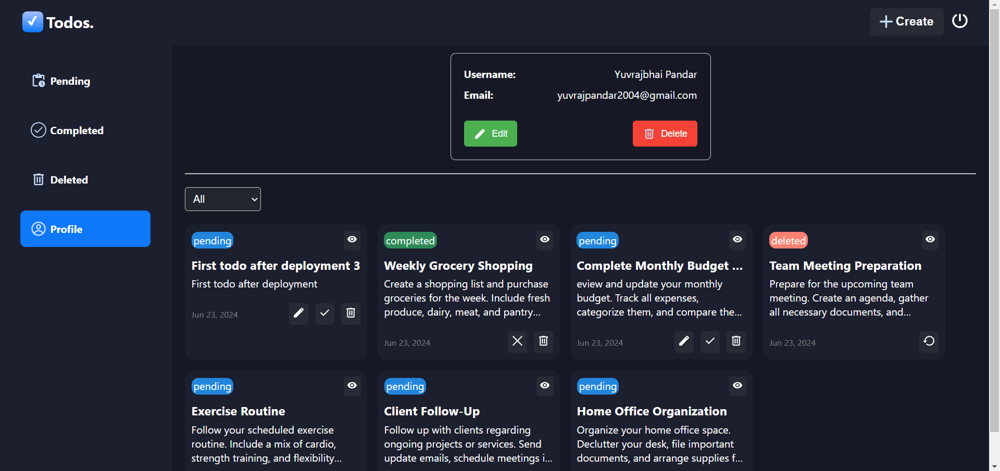
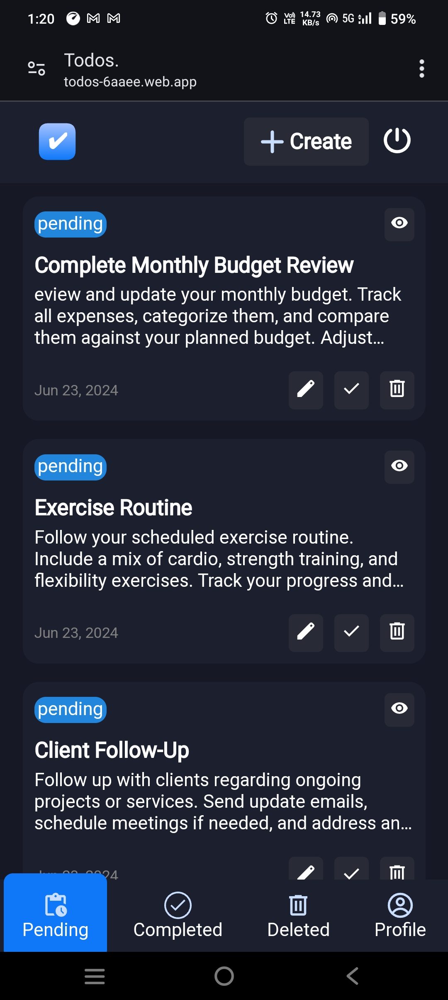
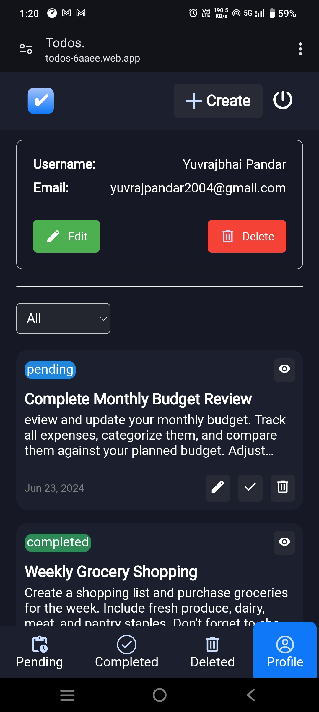

# Todos-Firebase

## Description

Full stack Task management web-app built with Reactjs (vite) + Firebase

## Demo

[https://todos-6aaee.web.app](https://todos-6aaee.web.app)

## Screenshots

<!-- #### Desktop view

<div style="display: flex; justify-content: space-around;">
  
  
</div>

#### Mobile view

<div style="display: flex; justify-content: space-around;">
  
  
</div> -->

## Tech stack

**Client:** React JS

**Server:** Firebase

**Authentication:** Firebase Authentication

**Database:** Firebase Firestore

## Features

- **Firebase authentication**

- **Firebase firestore**

- **Create Tasks**

- **Updating Tasks to deleted, completed, restore**

- **Edit, delete, logout, login, registration, google auth**

## Installation

To run this project locally, follow these steps:

1. Clone the repository:

```bash
  git clone https://github.com/Yuvrajshankar/Todos-Firebase.git
```

2. Go to the project directory

```bash
  cd Todos-Firebase
```

3. Install dependencies

```bash
  npm install
```

4. Add firebase configuration in **./src/firebase/config.js**

5. Start the application

```bash
  npm run dev
```

## Made By

- [@Yuvrajshankar](https://github.com/Yuvrajshankar)

## License

This project is licensed under the [MIT License](LICENSE).
